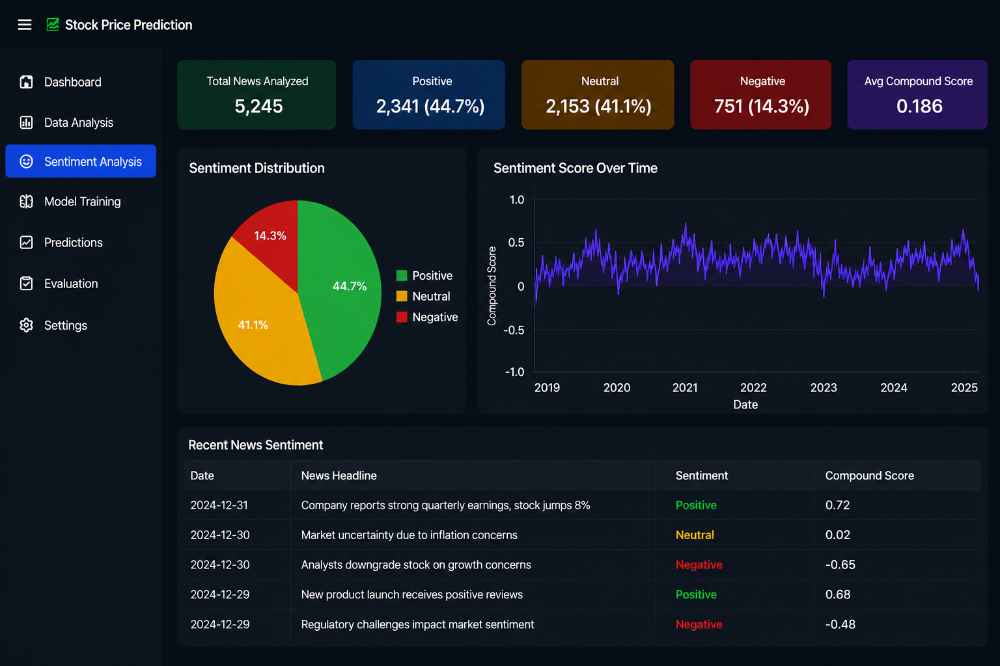
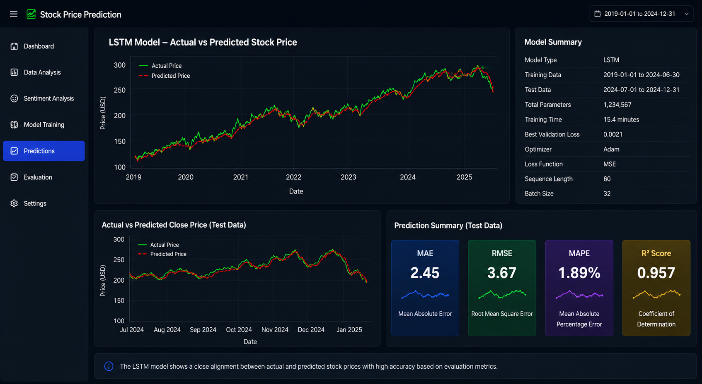
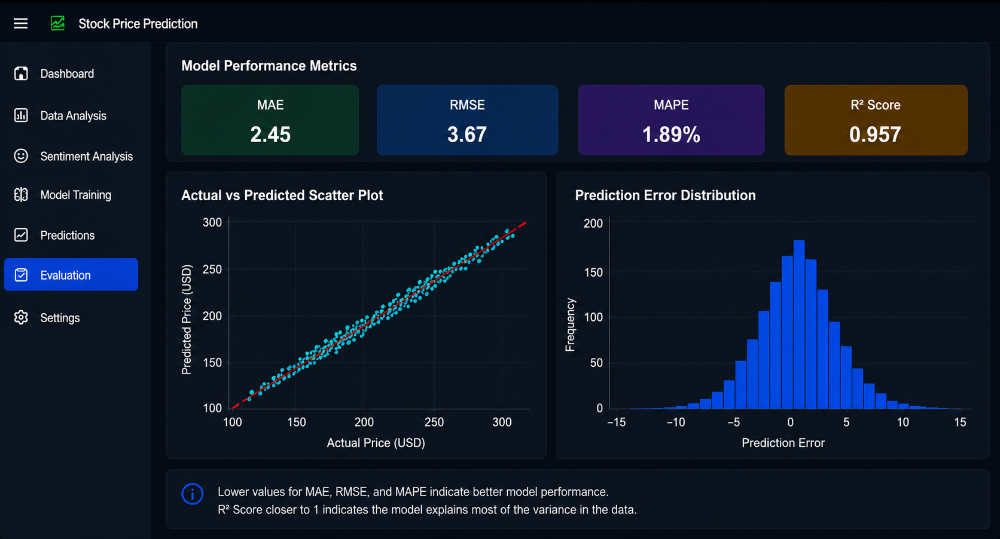
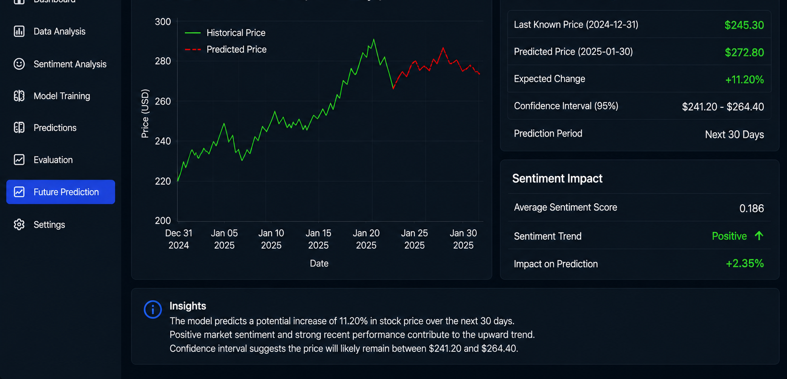

# stock-price-prediction-lstm-sentiment
# 📈 Stock Price Prediction Using LSTM and Sentiment Analysis

> Built an LSTM + Sentiment Analysis pipeline in Python to predict stock trends, integrating NLP-based signals with time-series data. Achieved R² Score of 0.957.

---

## 📊 Key Results

| Metric | Result |
|---|---|
| MAE | 2.45 |
| RMSE | 3.67 |
| MAPE | 1.89% |
| R² Score | 0.957 |
| News Analyzed | 5,245 |
| Stock Records | 1,508 |

---

## 🛠️ Tech Stack

- Python
- TensorFlow / Keras — LSTM Model
- VADER — Sentiment Analysis
- Pandas, NumPy, Scikit-learn
- Matplotlib, Seaborn
- Flask — Web Dashboard
- Chart.js — Frontend Visualization

---

## ✨ Features

- **Dashboard** — Stock price and volume overview
- **Data Analysis** — Close price, RSI, MACD, Moving Averages
- **Sentiment Analysis** — News sentiment distribution and compound scores
- **Model Training** — LSTM architecture and training loss curves
- **Predictions** — Actual vs predicted price charts
- **Evaluation** — MAE, RMSE, MAPE, R² with scatter plot and error distribution
- **Future Prediction** — 30-day forecast with 95% confidence interval

---

## 📸 Output Screenshots

### Dashboard

### Sentiment Analysis

### Predictions

### Evaluation

### Future Prediction

---

## 📁 Project Structure
stock-price-prediction-lstm-sentiment/
├── stock_prediction.ipynb   ← Jupyter Notebook (full pipeline)
├── app.py                   ← Flask web dashboard backend
├── templates/
│   └── index.html           ← Frontend dashboard
├── screenshots/             ← Output images
├── requirements.txt
└── README.md
